# Sathí 
Nuestro proyecto es una veterinaria que se llama Sathí. Sathí significa amigo en Nepalí. En la India se práctica el jainismo, religión que consiste en proteger a los animales. 
La veterinaria cuenta con una página web desde la que puedes realizar compras, agendar citas y conocer nuestros eventos. 

Nuestro proyecto empresarial es gestionado a través del sistema Odoo, haciendo uso de diferentes módulos, como:  
- Sitio Web
    Nuestra página web consta de:
    Una página de inicio en la que nos presentamos y puedes contactarnos.
    
    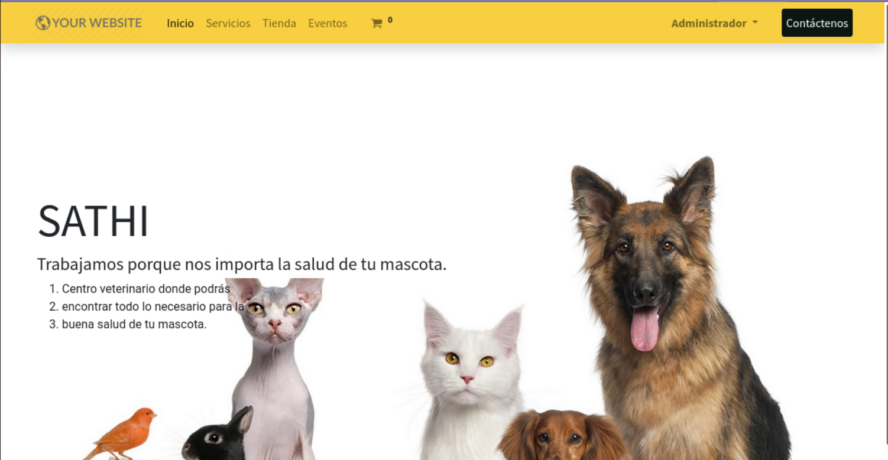

    Con una página de servicios desde la cual puedes gestionar una cita con el servicio que necesites y una tienda online.
    Y existe un apartado llamado eventos desde la que puedes observar los próximos eventos que ofrece nuestra veterinaria. 
    Contamos con un menú en la parte superior para trasladarse de una ventana a otra y un carrito de compras para gestionar los productos que quieras comprar. 
    
    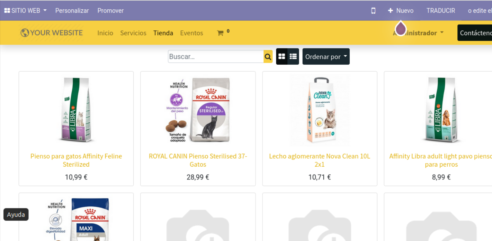

- Parte Marketing:

En este apartado se han utilizado los módulos Eventos, Calendario, Encuestas y Marketing por Email.
Para crear el evento Apertura de Veterinaria. He utilizado el módulo Eventos, y he configurado el evento con estos datos.

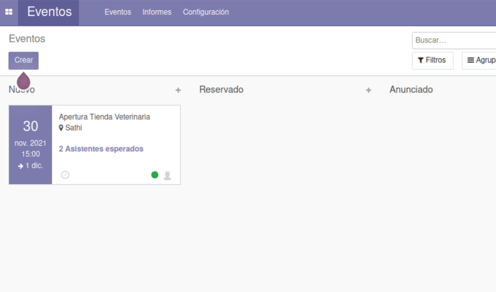

La configuracion del Evento.
Para poder crear eventos dentro del sistema de Odoo, hemos necesitado del módulo Evento. Se generará una parte de Servicios en la cuál puedes registrarte al Evento.

En la parte de Eventos he configurado una encuenta, para añadir feedback al evento, parte de Satisfacción por parte de la gente asistida al Evento.

Para dar información a los clientes más relevantes de la página, he utilizado el marketing por Email, que manda un Email de aviso a aquellos clientes o proveedores, que son relevantes.

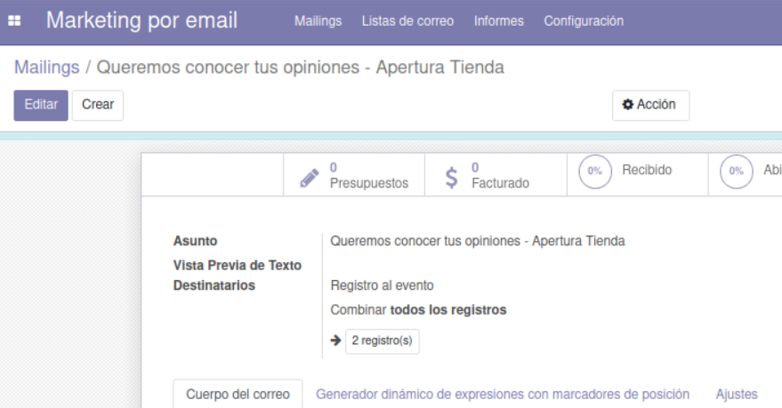

- Parte de Contactos:

En este apartado hemos creado varios Contactos de importancia para la página, como clientes, proveeedores y empleados. 

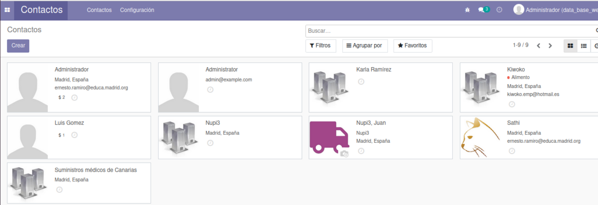
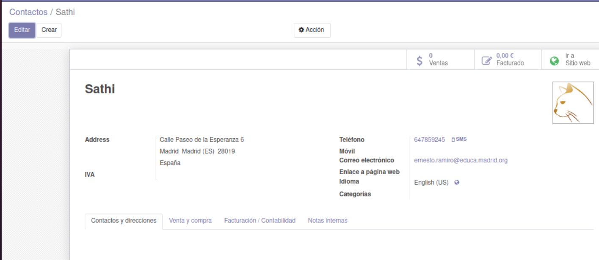

- Parte de la comunicación Interna:
Apartado en el cual hay un sistema de "Foro". En el cual puedes invitar a las personas que quieras conversar directamente con ella.

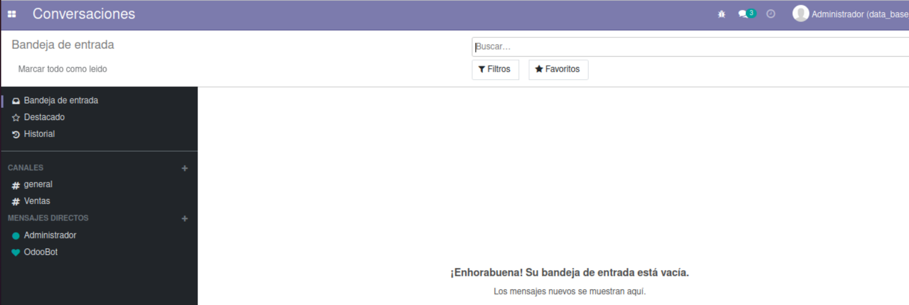

- Parte de Tareas de departamento de administración:

En este apartado, hemos incluido el módulo de Ventas en la cuál, hemos incluido algunos Productos y Servicios. 

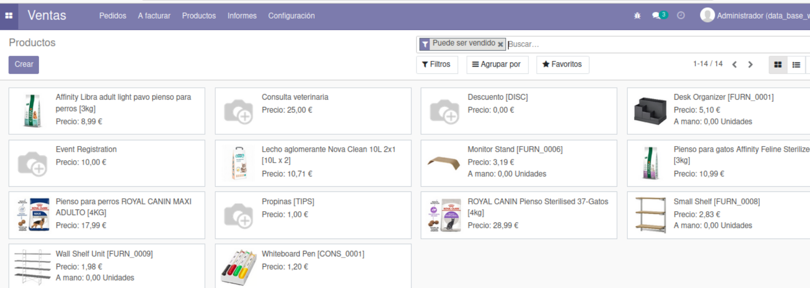

Podemos gestionar los pedidos, presupuestos y productos disponibles. 

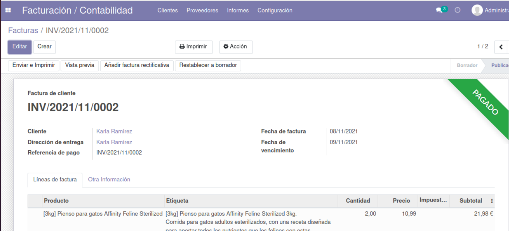

Para ello hemos usado los módulos de Facturación, Inventario, Compra y Punto de venta. 
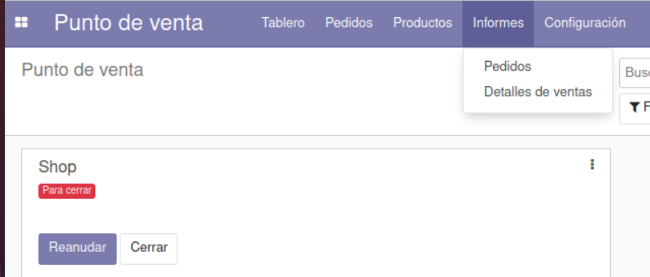

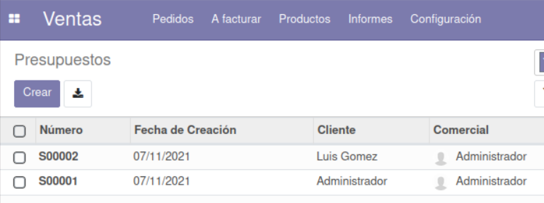

- Tablero "Metodologias ágiles y organizar":

Usaremos un tablero para organizar de una mejor forma el trabajo de los empleados.
Hemos instalado el módulo de Proyecto, que cuenta con diferentes departamentos, cada departamento cuenta con una serie de tareas a realizar. 

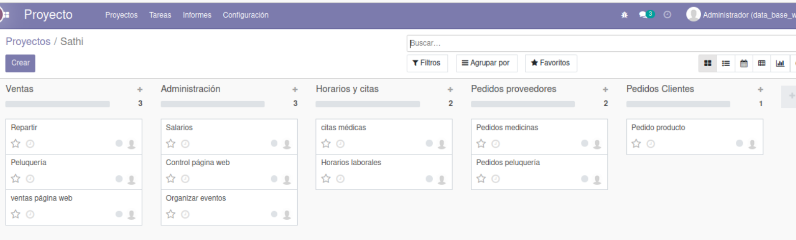

- Parte de control de Versiones y Copias de Seguridad:

Comenzamos a hacer la parte de versiones cuando teniamos hecho una gran parte del trabajo de la página, por lo que las subidas recientes son de hace muy poco tiempo. Las Copias de Seguridad se hicieron en local, y como en la parte de Versiones se subieron al mismo tiempo.

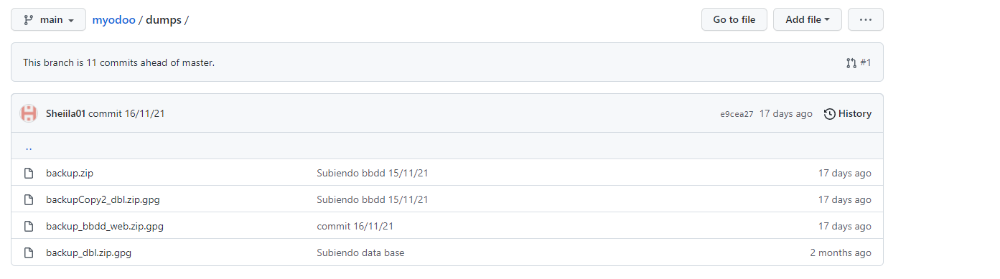
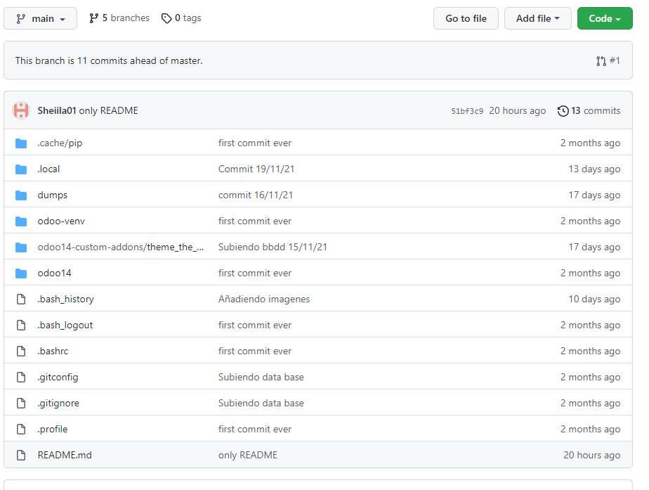
